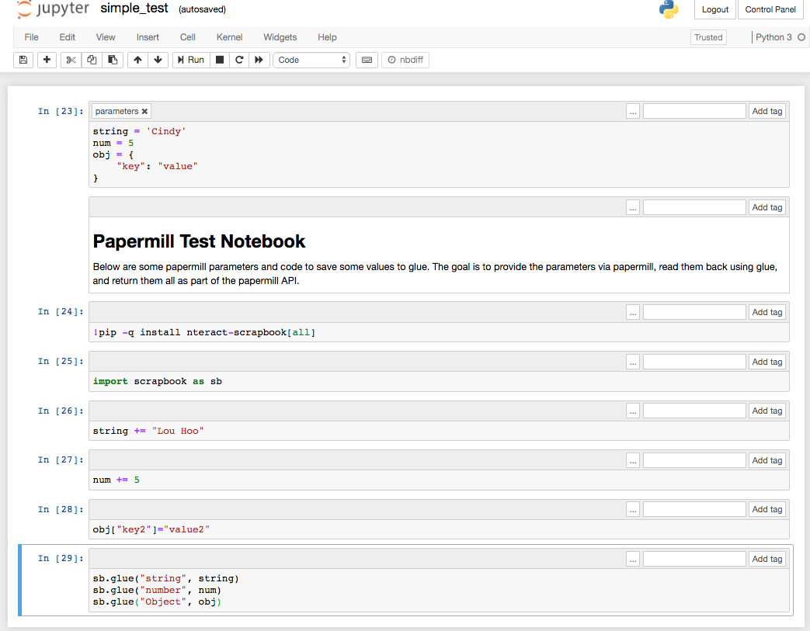

# Papermill API
##### HTTP API for Papermill and Jupyter Notebooks

Papermill is a library that enables execution of Jupyter notebooks on a server. This API leverages papermill and 
contains a dockerized flask web server that accepts HTTP calls specifying a Jupyter notebook on an Amazon S3 bucket 
along with parameters and execute it, delivering return variables in the result and storing a copy of the executed 
notebook.

## Startup
To start this API, environment variables must be defined to allow authentication to Amazon S3. This can be done either 
by prepending these environment variables on the docker-compose up command, or defining them in a `.env` file. Here is 
the form of the docker compose command defining the environment variables:

`AWS_ACCESS_KEY_ID=<id> AWS_SECRET_ACCESS_KEY=<key> docker-compose up`

If successful, the flask server will be running on http://localhost:5000.

## Run Notebook

The url for the run endpoint should contain the path to the notebook on S3 (starting with the bucket). Query parameters 
will be passed to the notebook for execution. More complex parameters can be defined in a post request as follows:

### GET

`curl http://localhost:5000/run/your-bucket/home/user.name/notebook_name.ipynb?parameter=one&parameter=two`

### POST

`curl -d @examples/run_notebook_post.json -H "Content-Type: application/text" -X POST http://localhost:5000/your-bucket/home/user.name/notebook_name.ipynb`

@examples/run_notebook_post.json:

```
{
  "parameters": {"obj":{"key":"value1"}, "num":"8"},
  "outputNotebookPath":"./new_folder/{{args.timestamp}}"
}
```

If the referenced S3 location is a valid notebook and authentication is successful, the notebook execution will be 
attempted, passing parameters.

## Parameters

To define default parameters for an input notebook, create a first cell in that notebook with a tag named "parameters" 
as shown below and define the relevant variables there. Papermill will recognize this cell in the input notebook and 
interpolate a new cell directly after the first overwriting any previously defined parameters. The output notebook will 
be executed. The result of the subsequent logic is what will be returned from the execution.


## Response

This API leverages the scrapbook library to support returning parameters from an executed notebook reflecting logic 
executed in the notebook. Simply ensure that the environment executing the notebook has the scrapbook library available, 
and pass the desired parameters to the scrapbook object. These will be added to the results of your call to this API. 

By default, the output notebook is stored in the same directory as the source. The location of the output notebook can 
be overridden either by passing an 'outputNotebookPath' in a post call or dynamically by defining a jinja2 template and 
passing relevant variable in the call to construct the output path.



The return from the previous notebook could look similar to this:

```
{
    "result": {
        "num": 10,
        "obj": {
            "key": "value1",
            "key2": "value2"
        }
    }
}
```

### Output Notebook Storage</b>:

By default, it is stored in the same directory as the source. If a full S3 path is given, (beginning with "s3://") the 
output will be stored on the S3 location assuming permissions and authentication are successful. The location of the 
output notebook can also be overridden either by passing an explicit 'outputNotebookPath' in a post call or dynamically
by defining a jinja2 template and passing the name of it in the POST call. A default template can be specified which 
will be used unless a static location is defined by passing an explicit 'outputNotebookPath'. Paths are relative to the 
app directory which is what is mounted from the container to the host filesystem.

Example of the json format for the post request:

```
{
  "parameters": {"obj":{"key":"value1"}, "num":"8"},
  "template": {
    "name": "template",
    "args":{"arg1":"Hello", "arg2":"World"}
  }
}
```

or

```
{
  "parameters": {"obj":{"key":"value1"}, "num":"8"},
  "outputNotebookPath":"./new_folder/{{args.timestamp}}"
}
```

The "template" and "outputNotebookPath" keys are optional. Specifying both will throw an error. 

## Templates
Templates use the jinja2 templating language. Templates are stored in a local SQLite instance. The following is an 
example template record contents:

```
{{args.timestamp}}//{{args.arg1}}//{{args.arg2}}
```

The args object is passed to the template for evaluation. Any argument that is available in the args object can be 
referenced in the template. `args.timestamp` and `args.notebook_name` are present by default. The above template 
corresponds to the post data object above and would yield a file path similar to the following relative to the app 
directory:

```
(app)/20190425074416/Hello/World
```

##Template Endpoints

### GET

Example GET call to retrieve a template:

`curl http://localhost:5000/template/{template_name}`

The form of the response:

```
[
    {
        "content": "{{args.timestamp}}//{{args.arg1}}//{{args.arg2}}",
        "name": "template"
    }
]
```

### POST

Example POST call to create or update a template <template name>:

`curl -d @example_data.json -H "Content-Type: application/json" -X POST http://localhost:5000/template/{template name}`

@example_data:

```
    {
        "content": "{{args.timestamp}}//{{args.arg1}}//{{args.arg2}}",
    }
``` 

Optionally to set as default template:


```
    {
        "content": "{{args.timestamp}}//{{args.arg1}}//{{args.arg2}}",
        "default":"true"
    }
``` 

### GET

Example GET call to list available templates:

`curl http://localhost:5000/template`

The response could look like this: 

```
[
    {
        "content": "{{args.timestamp}}//{{args.arg1}}//{{args.arg2}}",
        "name": "template"
    },
    {
        "content": "{{args.timestamp}}//{{args.different_arg1}}//{{args.different_arg2}}",
        "name": "another_template"
    }
]
```

Optionally, define a query parameter "default" to get only the default parameter:

`curl http://localhost:5000/template?default`

### POST

Templates can also be created or updated in the general template post end point by including the name parameter 
specifying the endpoint to be created.

`curl -d @example_data -H "Content-Type: application/json" -X POST http://localhost:5000/template/{template name}`

@example_data:

```
{
 "name": "template",
 "content":"{{args.timestamp}}//{{args.arg1}}//{{args.arg2}}",
 "default": "true"
}
```


### Return Status

If the executed notebook defines and appends to the scrapbook object a parameter 'statusCode' within the input notebook
: `sb.glue("statusCode", 201)` this will be the HTTP status code returned.
